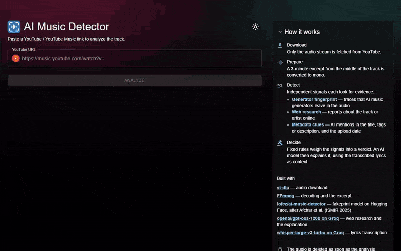
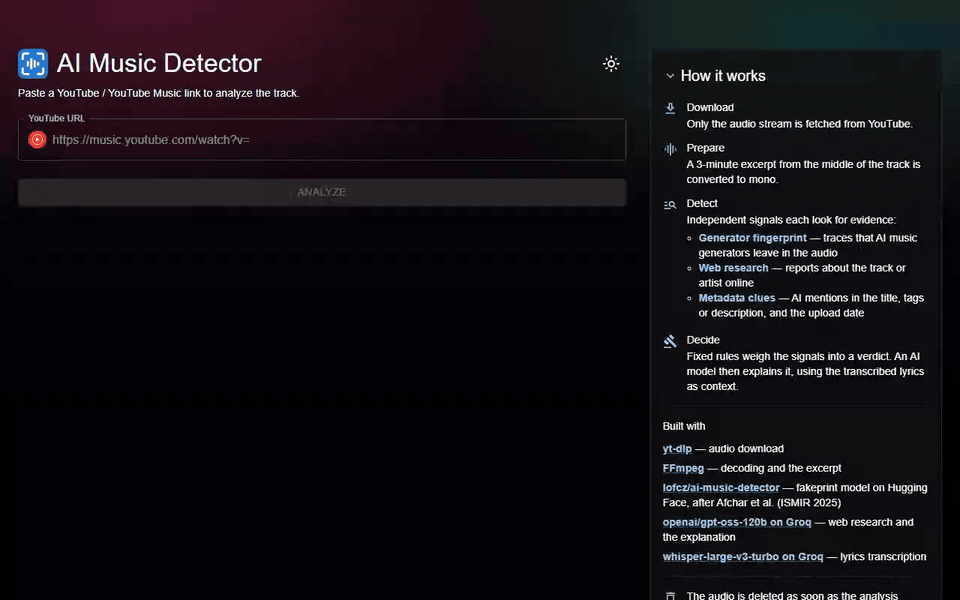

# ai-music-detector

Music track analyser to detect if it fully or partially AI generated

**Architecture:** [latest architecture report](https://artmus91.github.io/ai-music-detector/architecture/architecture-2026-10-01_140902.html)

## Demo

Paste a YouTube, YouTube Music or Spotify link and get a verdict (AI-generated, human-made or mixed) with an AI likelihood, a confidence score, the signals behind it and a written explanation.

**Human-made:** Rammstein – *Zick Zack*



**AI-generated:** The Velvet Sundown – *Dust on the Wind*



## Getting started

### API (.NET 10)

```
dotnet run --project src/Api
```

Serves `GET /health` and OpenAPI docs (dev only) on the URL printed at startup.

### ML service (Python + FastAPI)

```
cd ml
python -m venv .venv
.venv/Scripts/pip install -r requirements-dev.txt
.venv/Scripts/uvicorn app.main:app --reload --port 8000
```

Hosts the audio detectors the API calls during analysis (`GET /health` lists them). Or skip all of the above with `docker compose up -d`, which runs Postgres, the ML service and the API together.

### Web (React + TypeScript + MUI)

```
cd web
npm install
npm run dev
```

Serves the app at http://localhost:5173. The app calls the API's `/health` endpoint on load to confirm connectivity (set `VITE_API_BASE_URL` to override the default `http://localhost:5214`).

## Self-hosting (your own PC + Cloudflare Tunnel)

`docker-compose.prod.yml` layers a production setup over `docker-compose.yml`. It adds the built web app behind nginx, which proxies `/api` to the API, so everything is served from one origin, and a `cloudflared` container that publishes it over HTTPS. No ports are opened on your router. Running from a home connection also keeps yt-dlp working, because YouTube often blocks downloads from datacenter IPs.

1. Add a database password to the gitignored `.env` (it only takes effect on the first start; the production database has its own volume, separate from dev):
   ```
   POSTGRES_PASSWORD=<long random string>
   ```
2. Start it with **one** of the tunnel profiles:
   - **Quick tunnel** (no Cloudflare account; the URL changes on every restart):
     ```
     docker compose -f docker-compose.yml -f docker-compose.prod.yml --profile quick-tunnel up -d --build
     docker logs aimusicdetector-quick-tunnel 2>&1 | grep trycloudflare.com              # bash
     docker logs aimusicdetector-quick-tunnel 2>&1 | Select-String trycloudflare.com     # PowerShell
     ```
   - **Named tunnel** (stable hostname on a domain you have in Cloudflare): in the Cloudflare dashboard, create a tunnel under *Zero Trust → Networks → Tunnels* and add a public hostname with service `http://web:80`. Put its token in `.env` as `CLOUDFLARE_TUNNEL_TOKEN=...`, then:
     ```
     docker compose -f docker-compose.yml -f docker-compose.prod.yml --profile tunnel up -d --build
     ```
3. To check it without the tunnel, open http://localhost:8080.

Notes:
- The prod stack uses the same container names as the dev stack, so starting one replaces the other.
- Containers restart on their own (`restart: unless-stopped`). For the site to come back after a reboot, Docker Desktop has to start on login, and the PC must not go to sleep.
- yt-dlp is fetched when the API image is built. When YouTube downloads start failing, rebuild with `--build --pull` to pick up a newer yt-dlp.
- Submissions are rate-limited per visitor IP: nginx passes Cloudflare's `CF-Connecting-IP` header on to the API as `X-Forwarded-For`.
