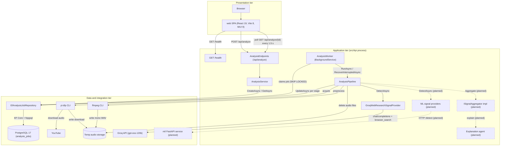
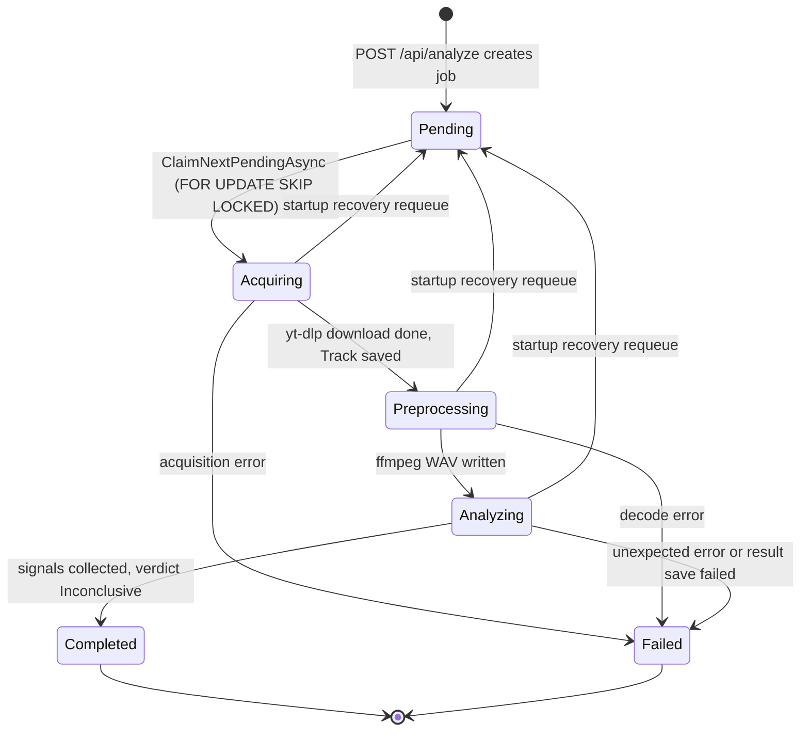
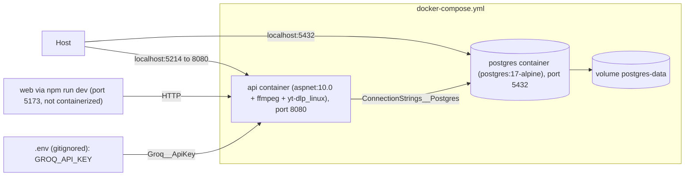

# Architecture report — 2026-09-24 11:57:49

| | |
|---|---|
| Previous report | none — baseline |
| MVP phase ([ROADMAP.md](../../ROADMAP.md)) | Phase 2 (preprocessing and background processing) complete; Phase 3 started early with the web-research signal only |

## Summary

AI Music Detector takes a YouTube / YouTube Music link and is meant to estimate whether the track is AI-generated. Today the full queue-and-process path works: a React SPA submits a URL, the .NET 10 minimal API persists a job in Postgres and returns 202, and an in-process `AnalysisWorker` claims jobs one at a time and hands them to `AnalysisPipeline`. The pipeline downloads audio with yt-dlp, normalizes it with ffmpeg to a WAV clip, and runs every registered `IDetectionSignalProvider`. There is one provider so far (Groq web research). No aggregator exists, so every completed job gets the verdict `Inconclusive`. The web UI shows job status, track metadata, and failure reasons, but not signals or verdicts yet.

## 3-tier overview

| Tier | Components | Technology / versions | Key files |
|---|---|---|---|
| Presentation | Single-screen SPA with a URL form, API health chip, and job card (status label, progress bar, track title/artist/duration, failure reason) | React 19.2, Vite 8.3, MUI 9.4 (+ Emotion 11), TypeScript 6.0, Vitest 4.1, oxlint 1.81 | [App.tsx](../../web/src/App.tsx), [api.ts](../../web/src/api.ts), [models/](../../web/src/models/) |
| Application | Minimal API (`/health`, `/api/analyze` group), `AnalysisService` (validation), `AnalysisWorker` (hosted service), `AnalysisPipeline` (stages, signal collection, audio cleanup), signal providers | .NET 10 (`net10.0`), ASP.NET Core minimal APIs, `Microsoft.AspNetCore.OpenApi` 10.0.12, `Scalar.AspNetCore` 2.17.8, built-in fixed-window rate limiter | [Program.cs](../../src/Api/Program.cs), [AnalysisEndpoints.cs](../../src/Api/Endpoints/AnalysisEndpoints.cs), [AnalysisWorker.cs](../../src/Api/BackgroundServices/AnalysisWorker.cs), [AnalysisService.cs](../../src/Analysis/Services/AnalysisService.cs), [AnalysisPipeline.cs](../../src/Analysis/Services/AnalysisPipeline.cs) |
| Data and integration | `AnalysisDbContext` + `EfAnalysisJobRepository` (one table, `analysis_jobs`, where `track`/`result` are `jsonb`), yt-dlp and ffmpeg run as child processes through `ExternalProcess`, Groq over a typed `HttpClient` | PostgreSQL 17 (alpine), `Npgsql.EntityFrameworkCore.PostgreSQL` 10.0.3, `EFCore.NamingConventions` 10.0.1 (snake_case), yt-dlp standalone binary, ffmpeg (apt) | [AnalysisDbContext.cs](../../src/Infrastructure/AnalysisDbContext.cs), [EfAnalysisJobRepository.cs](../../src/Infrastructure/Repositories/EfAnalysisJobRepository.cs), [YtDlpAudioAcquisitionService.cs](../../src/Infrastructure/Services/YtDlpAudioAcquisitionService.cs), [FfmpegAudioPreprocessor.cs](../../src/Infrastructure/Services/FfmpegAudioPreprocessor.cs), [GroqWebResearchSignalProvider.cs](../../src/Infrastructure/Services/GroqWebResearchSignalProvider.cs) |

Notes on the edges:
- The `POST` route has the `SubmitAnalysis` rate limit: 10 requests per minute per remote IP. Past that it returns 429.
- An invalid URL gets a 400 validation problem. A successful submit gets 202 with a `Location` header pointing to `GetAnalysis`. `GET /api/analyze/{id:guid}` returns 200 or 404.
- CORS allows only `http://localhost:5173`.
- The web client reads its base URL from `VITE_API_BASE_URL` and falls back to `http://localhost:5214`. It stops polling once the status is `Completed` or `Failed`.
- Downloads go to `YtDlp:WorkingDirectory`, which defaults to `<temp>/ai-music-detector/audio/<guid>/`. Each job gets its own folder, and the preprocessed `*.preprocessed.wav` is written next to the download.
- Migrations: [`20260923095847_InitialCreate`](../../src/Infrastructure/Migrations/20260923095847_InitialCreate.cs) → [`20260923140816_AddPreprocessedAudioPath`](../../src/Infrastructure/Migrations/20260923140816_AddPreprocessedAudioPath.cs). They are applied by `MigrateAsync()` when the API starts.

## Job state machine

Enum: [`AnalysisStatus`](../../src/Core/Models/AnalysisStatus.cs). It is stored as a string (max 32 chars) in `analysis_jobs.status`.

- **Cleanup.** Audio files are deleted before the terminal `UpdateAsync` in both outcomes. Startup recovery also deletes them and resets `Track` to null when it requeues a job.
- **Cancellation.** If the pipeline is cancelled during shutdown, it rethrows and leaves the job in its in-progress status. `RecoverInterruptedAsync` picks it up the next time the worker starts.
- **Failure reason.** A `UserFacingException` message is stored as-is. Any other failure gets a generic message for its stage. The reason is truncated to 2048 characters.
- **Failed save.** If saving the outcome fails, the pipeline records `Failed` with `Result = null` so the client never polls forever.

## Detection signals

| Provider | What it measures | External dependency | Failure behavior | Status |
|---|---|---|---|---|
| [`GroqWebResearchSignalProvider`](../../src/Infrastructure/Services/GroqWebResearchSignalProvider.cs) | Whether the track or artist is publicly known to be AI-generated. Score comes from the model's AI likelihood and weight from its confidence. Evidence links are kept only if they appear in Groq's `executed_tools` search results. With no verified evidence, the weight is capped at 0.3. | Groq API (`chat/completions`, model `openai/gpt-oss-120b`, `browser_search` tool), key from `Groq__ApiKey` | Throws `WebResearchException` if there is no API key, on a non-transient HTTP error, or on an unparseable reply. The pipeline logs it and leaves the signal out. Transient failures are retried up to `MaxAttempts` (3), honoring `Retry-After`. A track with no title returns a weight-0 signal. | Implemented |
| Spectral anomalies (Librosa / torchaudio) | Spectral artifacts in the preprocessed audio | `ml/` service (planned) | Planned to be isolated the same way as other providers (by the pipeline's per-provider try/catch) | Planned (Phase 3) |
| Vocal synthesis indicators | Deepfake-voice model scores | `ml/`, Hugging Face models | — | Planned (Phase 3) |
| Generative-audio artifacts | Artifacts left by generative models | `ml/` | — | Planned (Phase 3) |
| Metadata heuristics | Title/channel patterns, upload metadata | — | — | Planned (Phase 3) |
| Vocal / transcription analysis | Whisper-based analysis | `ml/` | — | Planned (Phase 3) |

Aggregation is also missing. [`ISignalAggregator`](../../src/Core/Services/ISignalAggregator.cs) is declared but nothing implements it. `AnalysisPipeline.UnaggregatedResult` stands in for it: it returns `Inconclusive` with `AiProbability` 0.5, `Confidence` 0, and the collected signals.

## Configuration & deployment

| Item | Details |
|---|---|
| `postgres` service | `postgres:17-alpine`, `5432:5432`, named volume `postgres-data`. It has a `pg_isready` healthcheck, and `api` waits until it is healthy. |
| `api` service | Built from [`src/Api/Dockerfile`](../../src/Api/Dockerfile). The build stage uses `dotnet/sdk:10.0` and the runtime uses `dotnet/aspnet:10.0`. Port mapping is `5214:8080`. `ASPNETCORE_ENVIRONMENT=Development`, so `/openapi/v1.json` and `/scalar/v1` are exposed in the container too. |
| Bundled binaries | ffmpeg installed with `apt-get`. The standalone `yt-dlp_linux` comes from the latest GitHub release and is not version-pinned. `YtDlp__ExecutablePath=/usr/local/bin/yt-dlp` |
| Config sections ([appsettings.json](../../src/Api/appsettings.json)) | `ConnectionStrings:Postgres`, `YtDlp` (`ExecutablePath`, `Timeout`, `MaxDuration` 15 min, `MaxFileSizeMegabytes` 100, optional `WorkingDirectory`), `Ffmpeg` (`ExecutablePath`, `Timeout`, `SampleRate` 44100, `MaxDuration` 3 min), `Groq` (`Model`, `Timeout`; `BaseUrl`/`MaxAttempts` use code defaults), `Logging`, `AllowedHosts` |
| Secrets | `Groq:ApiKey` is not in any appsettings file. It comes from `GROQ_API_KEY` in `.env`, which compose passes as `Groq__ApiKey`, or from an environment variable under `dotnet run`. Postgres credentials are dev defaults in appsettings and compose. |
| Web config | `VITE_API_BASE_URL` (default `http://localhost:5214`) |
| CI ([ci.yml](../../.github/workflows/ci.yml)) | Runs on push/PR to `main`. Job `api`: .NET 10.0.x restore, Release build, `dotnet test`. Job `web`: Node 22, `npm ci`, lint, test, build. |
| Tests | `tests/Core.Tests` (xUnit 2.9.3) has 26 test methods: pipeline 8, Groq provider 11, `AudioWindow` 4, `YouTubeUrl` 2, entity 1. The web app has 17 Vitest cases: `App.test.tsx` 8, `api.test.ts` 9. |

## Changes since previous report

Baseline — no previous report.

## Roadmap position

| Phase | Status in code |
|---|---|
| 0 — Foundations | Done. Core models and interfaces exist, along with the xUnit project and CI (build, test, lint). |
| 1 — Audio acquisition | Done. Includes the yt-dlp service, `POST`/`GET /api/analyze`, EF Core + Postgres, docker compose with the API image, and the web submit-and-poll flow. |
| 2 — Preprocessing and background processing | Done. Includes `FfmpegAudioPreprocessor` (44.1 kHz mono 16-bit WAV, 3-minute middle window), `AnalysisPipeline`, `AnalysisWorker`, startup requeue, and audio cleanup. |
| 3 — ML detection service | Partial. The Groq web-research signal is done. `ml/` is absent (verified), and no audio-based providers exist. |
| 4 — Aggregation and explanation | Not started. `ISignalAggregator` has no implementation and there is no explanation agent. |
| 5 — Result UI | Not started. The UI shows no verdict, confidence, or per-signal breakdown. |
| 6 — Observability and hardening | Not started. There is no OpenTelemetry. |
